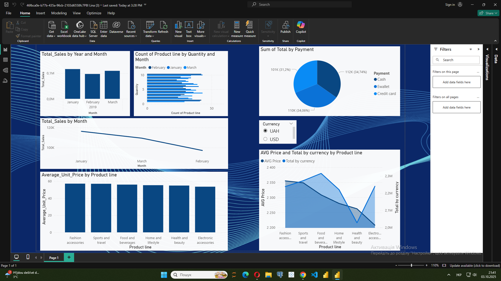

# Sales & Payment Analysis Dashboard (Power BI)

## 🎯 Goal
Analyze sales performance, product categories, and payment methods to identify revenue trends and customer preferences.

## 📂 Data
Dataset includes:
- Sales transactions (date, amount, product line)
- Product categories
- Payment methods (Cash, E-wallet, Credit Card)
- Currency (UAH, USD)

## 📊 Key Metrics
- **Total Sales by Month**  
- **Sales by Product Line**  
- **Average Unit Price by Product Line**  
- **Total Sales by Payment Method**  
- **Sales Trend Analysis**  
- **Currency-based Sales Comparison**

## 🔍 Insights
- Monthly sales trend shows seasonal decline after peak.  
- Product line analysis highlights top-performing categories.  
- Payment split reveals balanced use of Cash, Credit Card, and E-wallet.  
- Average price vs. total revenue gives insights into profitability by product type.  

## 🖼 Preview

